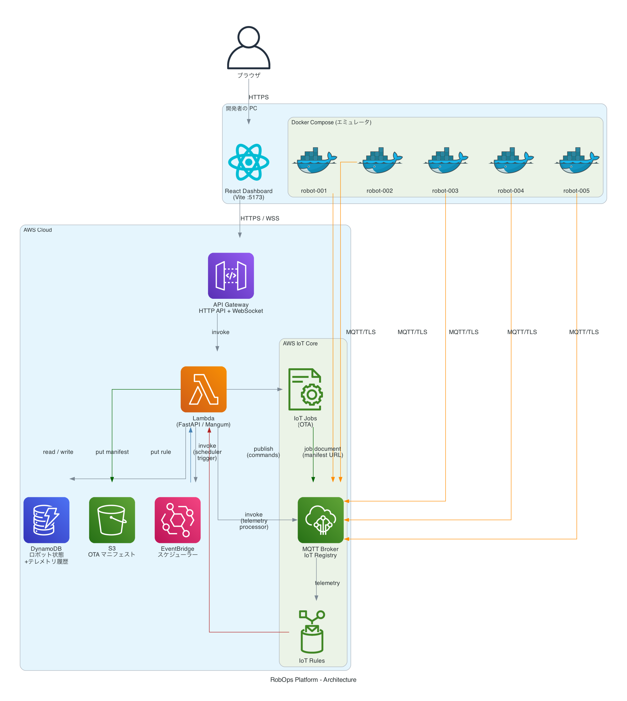

# RobOps Platform - 技術仕様書

## 概要

お掃除ロボットの運用管理プラットフォーム。AWS IoT Coreを中核に、複数ロボットのリアルタイム監視・制御・OTAアップデート・スケジューリングを実現する。実物ロボットは用意せず、**ロボットエミュレータ (Docker Compose)** でデモを行う。5台のエミュレータロボットを扱うが、数万台規模へのスケールを前提としたアーキテクチャとする。

---

## システムアーキテクチャ

> 図の生成: `python3 docs/architecture.py` → `docs/architecture.png`



> **ローカルで動かすのはエミュレータ (Docker Compose) と Vite dev server のみ。**
> フロントエンドは `VITE_API_URL` に API Gateway の URL を指定して直接 AWS にリクエストする。
> LocalStack は使わず、すべて実 AWS リソースに接続する。

```
  開発者のPC
  ┌──────────────────────────────────────────────┐
  │                                                │
  │  Docker Compose (エミュレータ)                 │
  │  ┌──────────┐  ┌──────────┐  ┌──────────┐    │
  │  │robot-001 │  │robot-002 │  │robot-003 │... │
  │  │(Python)  │  │(Python)  │  │(Python)  │    │
  │  │certs:vol │  │certs:vol │  │certs:vol │    │
  │  └────┬─────┘  └────┬─────┘  └────┬─────┘    │
  │       └─────────────┴─────────────┘           │
  │                     │                         │
  │  Vite dev (:5173)   │ MQTT/TLS (AWS IoT Core) │
  │  ┌────────────────┐ │                         │
  │  │React Dashboard │ │                         │
  │  │VITE_API_URL=   │ │                         │
  │  │  <apigw URL>   │ │                         │
  │  └───────┬────────┘ │                         │
  └──────────┼──────────┼─────────────────────────┘
             │ HTTPS/WSS│
             ↓          ↓
┌────────────────────────────────────────────────────┐
│  AWS CLOUD                                          │
│                                                     │
│  ┌─────────────────────┐   ┌─────────────────────┐ │
│  │  API Gateway        │   │  AWS IoT Core        │ │
│  │  HTTP API           │   │  MQTT Broker         │ │
│  │  WebSocket API      │   │  IoT Registry        │ │
│  └────────┬────────────┘   │  IoT Rules / Jobs    │ │
│           ↓                └──────────┬───────────┘ │
│  ┌─────────────────────┐             │              │
│  │  Lambda             │    IoT Rule │(telemetry)   │
│  │  (FastAPI / Mangum) │◄────────────┘              │
│  │  ・ロボット管理 API  │                            │
│  │  ・コマンド送信      │─── IoT publish ───────────►│
│  │  ・テレメトリ取得    │                            │
│  │  ・スケジュール管理  │                            │
│  │  ・OTA 管理         │                            │
│  └──────┬──────────────┘                            │
│         │                                           │
│  ┌──────┴──────┐  ┌────────────────┐               │
│  │  DynamoDB   │  │  EventBridge   │               │
│  │  ロボット状態│  │  スケジュール  │               │
│  │ +テレメトリ  │  │  トリガー      │               │
│  └─────────────┘  └────────────────┘               │
└────────────────────────────────────────────────────┘
```

---

## ディレクトリ構成

```
robops_platform/
├── SPEC.md                          # 本仕様書
├── README.md
├── .github/
│   └── workflows/
│       ├── ci.yml                   # CI (lint + test)
│       └── deploy-backend.yml       # Lambda デプロイ
│
├── infrastructure/                  # Terraform
│   ├── environments/
│   │   └── dev/
│   └── modules/
│       ├── iot_core/
│       ├── dynamodb/
│       ├── lambda/
│       ├── api_gateway/
│       └── eventbridge/
│
├── backend/                         # Python FastAPI
│   ├── app/
│   │   ├── main.py                  # FastAPI エントリポイント
│   │   ├── api/
│   │   │   ├── robots.py            # ロボット管理API + コマンド送信API
│   │   │   ├── telemetry.py         # テレメトリAPI
│   │   │   ├── schedules.py         # スケジュールAPI
│   │   │   └── ota.py               # OTA管理API
│   │   ├── models/
│   │   │   ├── robot.py
│   │   │   └── telemetry.py
│   │   ├── services/
│   │   │   ├── iot_service.py       # AWS IoT Core操作
│   │   │   ├── dynamodb_service.py
│   │   │   ├── telemetry_service.py # テレメトリ (DynamoDB に保存)
│   │   │   └── scheduler_service.py
│   │   └── websocket/
│   │       └── handler.py           # WebSocket Lambda
│   ├── lambda_handlers/
│   │   ├── telemetry_processor.py   # IoT Rule → DynamoDB
│   │   ├── websocket_broadcaster.py # DynamoDB Stream → WebSocket
│   │   └── scheduler_trigger.py    # EventBridge → IoT command
│   ├── tests/
│   ├── pyproject.toml
│   └── requirements.txt
│
├── emulator/                        # ロボットエミュレータ
│   ├── docker-compose.yml
│   ├── robot/
│   │   ├── Dockerfile
│   │   ├── main.py                  # ロボットエミュレータ本体
│   │   ├── robot_state.py           # ロボット状態機械
│   │   ├── mqtt_client.py           # AWS IoT MQTT接続
│   │   └── config.py
│   ├── certs/                       # IoT証明書 (git-ignored)
│   └── README.md
│
└── frontend/                        # React + Vite
    ├── src/
    │   ├── main.tsx
    │   ├── App.tsx
    │   ├── components/
    │   │   ├── FleetMap/             # 3D フロアマップ + ロボット位置 (Three.js)
    │   │   │   ├── FleetMap.tsx      # re-export
    │   │   │   └── FleetMap3D.tsx    # @react-three/fiber 実装
    │   │   ├── RobotCard/            # 個別ロボット情報カード
    │   │   ├── TelemetryChart/       # バッテリー・速度グラフ
    │   │   ├── CommandPanel/         # コマンド送信UI
    │   │   ├── ScheduleManager/      # スケジュール管理
    │   │   ├── OTAManager/           # OTAアップデートUI
    │   │   └── common/               # 共通コンポーネント
    │   ├── hooks/
    │   │   ├── useRobots.ts
    │   │   ├── useWebSocket.ts
    │   │   └── useTelemetry.ts
    │   ├── api/
    │   │   └── client.ts             # APIクライアント
    │   └── types/
    │       └── robot.ts
    ├── package.json
    ├── vite.config.ts
    ├── tsconfig.json
    └── biome.json                    # Biome (linter/formatter, ESLint の代替)
```

---

## MQTTトピック設計

| トピック | 方向 | 説明 |
|---------|------|------|
| `robots/{robot_id}/telemetry` | Robot → Cloud | バッテリー・位置・速度・状態を定期送信 |
| `robots/{robot_id}/status` | Robot → Cloud | 接続状態 (online/offline) |
| `robots/{robot_id}/commands` | Cloud → Robot | コマンド送信 |
| `$aws/things/{robot_id}/jobs/notify` | Cloud → Robot | IoT Jobs通知 (OTA) |
| `$aws/things/{robot_id}/jobs/+/get` | Robot ↔ Cloud | OTAジョブ詳細取得 |
| `$aws/things/{robot_id}/jobs/+/update` | Robot → Cloud | OTAジョブ進捗更新 |

### テレメトリペイロード例
```json
{
  "robot_id": "robot-001",
  "timestamp": "2024-01-01T00:00:00Z",
  "battery_level": 85.5,
  "position": {"x": 3.2, "y": 1.8, "room": "living_room"},
  "speed": 0.5,
  "status": "CLEANING",
  "firmware_version": "1.0.0",
  "error_code": null,
  "cleaning_progress": 42.0
}
```

### コマンドペイロード例
```json
{
  "command": "START_CLEANING",
  "params": {"room_id": "living_room"},
  "issued_by": "dashboard",
  "timestamp": "2024-01-01T00:00:00Z"
}
```

---

## ロボット状態機械

```
         ┌──────────────────┐
         │      IDLE        │◄──────────────┐
         └────────┬─────────┘               │
                  │ START_CLEANING           │ STOP / 掃除完了
                  ▼                          │
         ┌──────────────────┐               │
         │    CLEANING      ├───────────────┘
         └──┬────────────┬──┘
            │            │
  battery<20%│            │RETURN_TO_DOCK コマンド
            ▼            ▼
   ┌──────────────┐  ┌───────────────────┐
   │ LOW_BATTERY  │  │ RETURNING_TO_DOCK │
   └──────┬───────┘  └─────────┬─────────┘
          │                    │
          └──────┬─────────────┘
                 │ ドック到達
                 ▼
         ┌──────────────────┐
         │    CHARGING      │
         └──────────────────┘
                 │ battery=100%
                 ▼
         ┌──────────────────┐
         │      IDLE        │

※ UPDATING: OTA実行中（いつでも遷移可能）
※ ERROR: 異常検知時
```

---

## AWS IoT スケーラビリティ設計

### なぜこの構成で大規模対応できるか

| 要素 | スケール設計 |
|------|------------|
| AWS IoT Core | フルマネージド。数百万デバイスに対応。追加設定不要 |
| DynamoDB | On-Demand Capacity。書き込み/読み込みが自動スケール |
| Lambda | 同時実行数を自動スケール（デフォルト上限1000→申請で拡張可） |
| API Gateway | 完全マネージド。秒間数万リクエスト対応 |
| IoT Fleet Indexing | フリート横断クエリ（"battery < 20% のロボット全台"等） |
| IoT Jobs | 大規模デバイスへのOTA一括配信。ロールアウト戦略設定可 |

### DynamoDBテーブル設計

テレメトリ時系列データは Timestream を使わず **DynamoDB に直接保存**する。

**robots テーブル**
```
PK: robot_id (String)
SK: -
Attributes: name, status, battery_level, position, speed,
            firmware_version, last_seen, room_assignment
GSI: status-index (status → robot_id でフリートフィルタ)
```

**telemetry テーブル**
```
PK: robot_id (String)
SK: timestamp (String, ISO8601)
Attributes: battery_level, speed, status, room, position_x, position_y
TTL: ttl (24時間で自動削除)
```

**schedules テーブル**
```
PK: schedule_id (String)
SK: robot_id (String)
Attributes: cron_expression, room_id, enabled,
            eventbridge_rule_name, created_at
```

**ota_jobs テーブル**
```
PK: job_id (String)
SK: robot_id (String)
Attributes: firmware_version, status, progress, started_at, completed_at
```

---

## API エンドポイント設計

### REST API (HTTP API Gateway)

| Method | Path | 説明 |
|--------|------|------|
| GET | /robots | ロボット一覧取得 |
| GET | /robots/{robot_id} | ロボット詳細取得 |
| POST | /robots/{robot_id}/commands | コマンド送信 |
| GET | /robots/{robot_id}/telemetry | テレメトリ履歴取得 |
| GET | /schedules | スケジュール一覧 |
| POST | /schedules | スケジュール作成 |
| DELETE | /schedules/{schedule_id} | スケジュール削除 |
| GET | /ota/jobs | OTAジョブ一覧 |
| POST | /ota/jobs | OTAジョブ作成（速度変更ファームウェア） |
| GET | /ota/jobs/{job_id} | OTAジョブ状態取得 |

### WebSocket API (リアルタイム通知)

| 種別 | 説明 |
|--------|------|
| クライアント→サーバー | `subscribe_robot`: ロボット更新の購読開始（接続後送信すると全ロボット現在状態を取得） |
| サーバー→クライアント | `initial_state`: 接続時または subscribe_robot 受信時、全ロボットの現在状態を一括送信 |
| サーバー→クライアント | `robot_update`: 1 台のロボット状態が更新されたときにそのロボットの最新状態を送信 |

---

## OTA (ファームウェア更新) 設計

デモでは「移動速度の変更」をファームウェアアップデートとして扱う。

### フロー
1. ダッシュボードから「OTA実行」ボタン押下（対象ロボット選択、新速度指定）
2. バックエンドが S3 に「ファームウェアマニフェスト」をアップロード
3. AWS IoT Jobs でジョブを作成し、対象ロボットに配信
4. エミュレータロボットが IoT Jobs 通知を受信
5. マニフェストに従って移動速度を更新
6. ジョブ進捗を IoT Jobs API で更新 (IN_PROGRESS → SUCCEEDED)
7. ダッシュボードでリアルタイム進捗確認

### OTAマニフェスト例
```json
{
  "version": "1.2.0",
  "changes": {
    "max_speed": 0.8,
    "description": "速度を 0.5 → 0.8 m/s に更新"
  }
}
```

---

## スケジュール設計

- EventBridge Scheduler でcron式を登録
- 指定時刻に Lambda をトリガー
- Lambda が対象ロボットに START_CLEANING コマンドを送信

---

## フロントエンド画面設計

### 1. フリートダッシュボード (メイン画面)
- **3D フロアマップ** (@react-three/fiber) 上に全ロボットの現在位置をリアルタイム表示
  - ロボットはステータス色の3Dメッシュ（ボディ＋ドーム）で表現
  - lerp による位置スムージング (LERP_SPEED=12)
  - ドラッグで視点回転、スクロールでズーム (OrbitControls)
- 各ロボットのステータスバッジ (色分け)
- バッテリー残量の一覧
- アクティブアラート表示

### 2. ロボット詳細画面
- デジタルツイン表示 (状態・位置・速度・バッテリー)
- バッテリー推移グラフ (過去1時間)
- 走行速度グラフ (過去1時間)
- コマンドパネル (掃除開始/停止/充電ドックへ戻す/部屋指定)

### 3. スケジュール管理画面
- スケジュール一覧
- 新規スケジュール作成 (ロボット選択・部屋選択・日時設定)
- 有効/無効切り替え

### 4. OTA管理画面
- ロボット別ファームウェアバージョン一覧
- OTAジョブ作成 (対象ロボット選択・新速度指定)
- ジョブ進捗一覧 (リアルタイム更新)

---

## CI/CD 設計

### GitHub Actions ワークフロー

**CI (全ブランチ・PR)**
- Python: `uv run ruff check` (lint) + `uv run pytest` (unit tests)
- TypeScript: **Biome** (lint/format) + Vitest
- Terraform: fmt check + validate + tflint

**CD (mainブランチマージ時)**
- Backend: `uv export` で requirements.txt 生成 → Lambda ZIP → Lambda更新 (`deploy-backend.yml`)

**Python 環境管理ルール**
- `pip` は使わない。すべて `uv` で統一
- ローカル開発: `uv sync` で仮想環境セットアップ
- スクリプト実行: `uv run python ...` または `uv run pytest`
- 依存追加: `uv add <package>` / dev依存: `uv add --dev <package>`
- Lambda デプロイ用: `uv export --no-dev -o requirements.txt`

---

## ロボットエミュレータ設計

### 動作概要
- 各エミュレータはAWS IoT Coreに接続 (TLS証明書認証)
- デフォルト 2 秒ごとにテレメトリを送信 (`TELEMETRY_INTERVAL` 環境変数で変更可)
- コマンドトピックを購読し、受信時に状態遷移
- バッテリーは時間経過で減少 (掃除中は速く、充電中は増加)
  - 消費レート: 0.0084 %/s × elapsed × 60（1部屋で約50%消費）
  - 充電レート: 0.083 %/s × elapsed × 60（約10分でフル充電）
- **バウストロフェドン（ジグザグ往復）経路**で部屋を網羅的に掃除
  - Y方向にストリップ幅 0.35m で往復、壁から 0.25m のマージンを保持
- 実機を想定した物理挙動を遵守
  - 掃除開始時は現在位置（ドック等）から物理的に移動して第1ウェイポイントへ向かう（瞬間移動なし）
  - RETURNING_TO_DOCK 時も現在位置から直線的にドックへ移動
  - OTA 適用は速度パラメータの変更（`max_speed`: 0.1〜2.0 m/s）

### 実行環境

Docker Compose でローカル起動する。証明書は `emulator/certs/<robot_id>/` にボリュームマウント。

```bash
cd emulator && docker compose up -d
```

---

## セキュリティ設計

| 要素 | 対策 |
|------|------|
| ロボット認証 | X.509証明書 (IoT Thing Certificate) |
| IoTポリシー | 各ロボットは自分のトピックのみ pub/sub 可 |
| 証明書管理 | `emulator/certs/` に配置 (git-ignored) |
| 通信暗号化 | MQTT over TLS 1.2、HTTPS のみ |

---

## 実装ステップ

### Phase 1: 基盤構築 (Step 1-3)
1. ✅ **プロジェクト初期化** - ディレクトリ構造、git、CI/CD設定、Linting (Biome)
2. ✅ **Terraform基盤** - IoT Core、DynamoDB、Lambda、API Gateway
3. ✅ **ロボットエミュレータ** - Docker Compose + Python MQTT クライアント + バウストロフェドン経路

### Phase 2: バックエンド (Step 4-5)
4. ✅ **FastAPI バックエンド** - Lambda/Mangum 両対応、REST API、IoT連携
5. ✅ **Lambda IoT処理** - テレメトリ処理、WebSocket通知、スケジューラー

### Phase 3: フロントエンド (Step 6-7)
6. ✅ **Reactダッシュボード基盤** - 3D フリートマップ (Three.js)、ロボットカード、リアルタイム
7. ✅ **高度UI + 結合テスト** - グラフ、スケジュール管理、OTA管理、Lambda バグ修正

### Phase 4: 統合・完成 (Step 8)
8. 🔲 **E2E統合テスト** - エミュレータ↔IoT↔API↔ダッシュボード動作確認

---

## 使用技術スタック一覧

| カテゴリ | 技術 |
|---------|------|
| フロントエンド | React 19, Vite 8, TypeScript, TanStack Query v5, Recharts v3, Tailwind CSS v4 |
| **3D レンダリング** | **Three.js, @react-three/fiber v9, @react-three/drei v10** |
| バックエンド | Python 3.12, FastAPI, Mangum, Pydantic v2, boto3 |
| **Python パッケージ管理** | **uv** (仮想環境・依存関係管理・スクリプト実行すべて uv で統一) |
| IoT | AWS IoT Core, MQTT (AWSIoTPythonSDK v2 / awscrt), AWS IoT Jobs |
| データベース | DynamoDB (ロボット状態 + テレメトリ履歴) |
| インフラ | Terraform 1.7+, AWS Lambda, API Gateway v2, EventBridge, DynamoDB, AWS IoT Core |
| CI/CD | GitHub Actions, Ruff, **Biome** (ESLint の代替), pytest, Vitest, tflint |
| エミュレータ | Docker Compose, Python |

---

*作成日: 2024年*
*最終更新: 2026-03-14*
*バージョン: 1.2*
