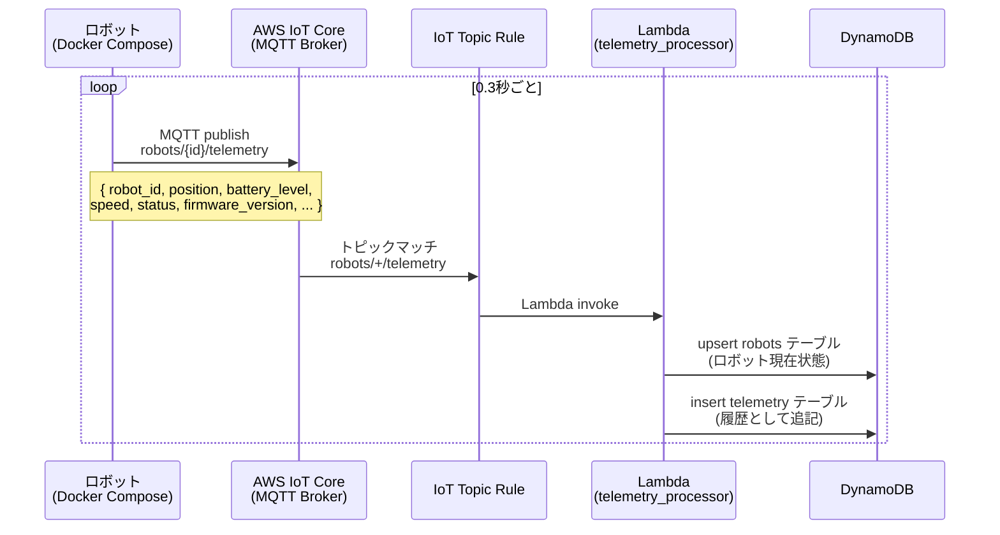
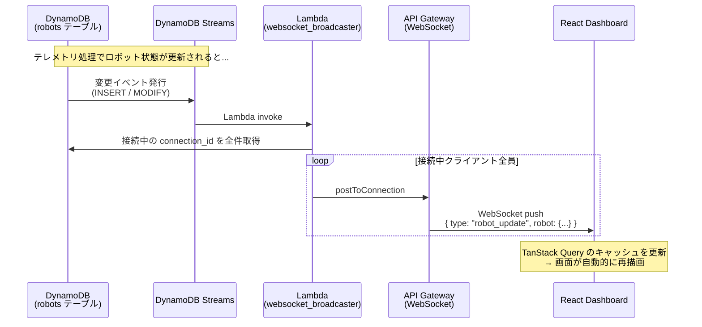
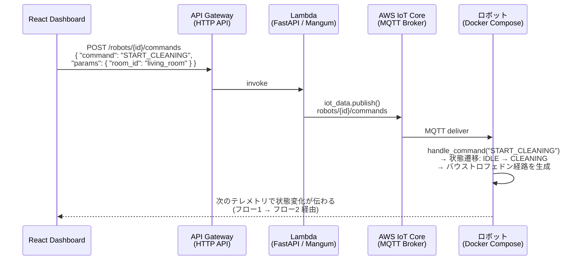
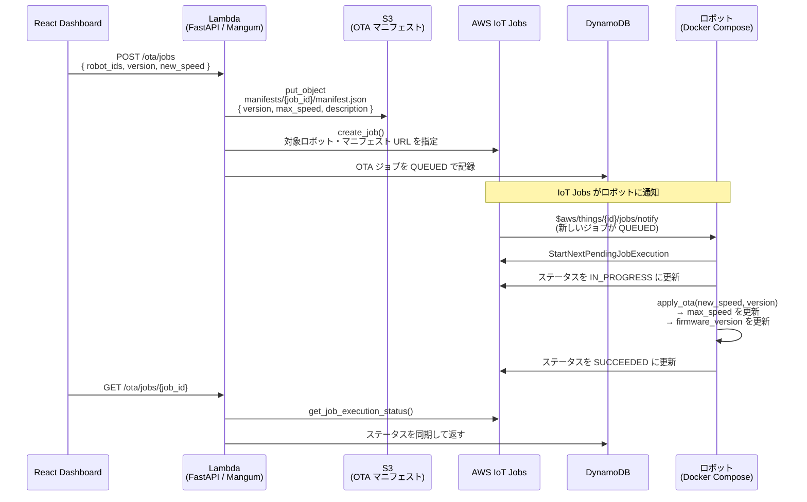
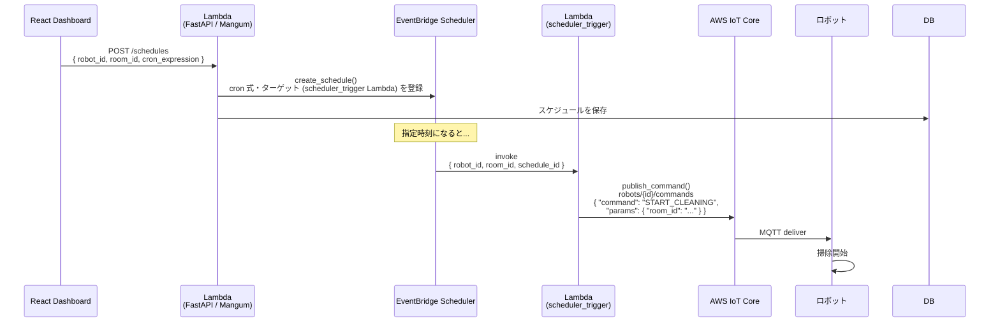
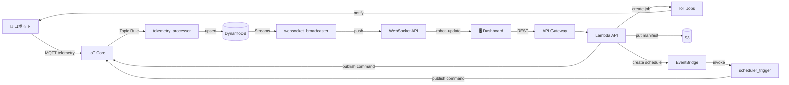

# RobOps Platform - 技術解説

AWS IoT Core を中心に、お掃除ロボットの運用管理プラットフォームを作った。RobOps とは何か、アーキテクチャをどう設計したか、AWS IoT 周りの仕組みを中心にまとめる。

---

## 目次

1. [RobOps とは](#1-robops-とは)
2. [全体アーキテクチャとスケーリングの考え方](#2-全体アーキテクチャとスケーリングの考え方)
3. [AWS IoT 深掘り](#3-aws-iot-深掘り)
4. [テレメトリ収集](#4-テレメトリ収集)
5. [リアルタイム画面更新](#5-リアルタイム画面更新)
6. [コマンド送信](#6-コマンド送信)
7. [OTA アップデート](#7-ota-アップデート)
8. [スケジュール実行](#8-スケジュール実行)
9. [データフローの全体像](#9-データフローの全体像)

---

## 1. RobOps とは

**RobOps（Robot Operations）** は DevOps の考え方をロボット運用に持ち込んだもの。ロボットが動くだけでなく、状態の監視・リモート操作・ファームウェア更新・自動スケジューリングをクラウドから管理できる状態を目指す。

家庭用の掃除ロボットが1台なら物理的に操作すればいい。ただ、商業施設や倉庫で何十〜何百台が動いていると話が変わる。

| 現場の課題 | このプラットフォームでの対応 |
|-----------|---------------------------|
| 全台の稼働状況をリアルタイムで把握したい | テレメトリ収集 + リアルタイムダッシュボード |
| 特定のロボットを遠隔で止めたい・指示したい | クラウド経由のコマンド送信 |
| バグ修正や改善を全台に配布したい | OTA アップデート |
| 夜間など無人の時間に自動稼働させたい | スケジュール実行 |
| 台数が増えてもシステムが壊れないようにしたい | サーバーレス・スケーラブルな構成 |

---

## 2. 全体アーキテクチャとスケーリングの考え方

### 構成の概要

```
ローカル PC
┌──────────────────────────────────────────┐
│  React Dashboard (Vite)                  │
│  Docker Compose × 5台（ロボットエミュレータ）│
└───────────┬──────────────────────────────┘
            │ HTTPS / WSS / MQTT/TLS
            ▼
AWS
┌──────────────────────────────────────────────────────┐
│                                                      │
│  API Gateway ──► Lambda (FastAPI) ──► DynamoDB       │
│  (HTTP + WebSocket)      │                │          │
│                          │            Streams        │
│                     IoT Core ◄──────► Lambda         │
│                          │         (broadcaster)     │
│                     IoT Rules / Jobs                 │
│                     S3 (OTA manifests)               │
│                     EventBridge Scheduler            │
└──────────────────────────────────────────────────────┘
```

### サーバーレスを選んだ理由

EC2 や ECS で常時起動サーバーを立てる構成も普通にある。ただロボット運用はトラフィックが偏る。夜間の一斉清掃開始時は全台からテレメトリが集中するが、昼間のアイドル時間はほぼ静か、みたいな状況が普通にある。

Lambda + API Gateway はリクエスト単位でスケールするのでこういう負荷パターンに相性がいい。

| | EC2/ECS | Lambda + API Gateway |
|--|---------|---------------------|
| スケール | Auto Scaling（分単位） | 自動（ミリ秒単位） |
| コスト | 常時稼働分を払う | リクエスト数課金 |
| 管理コスト | OS・ミドルウェアのパッチが必要 | 不要 |
| Cold Start | なし | あり（初回 ~500ms） |


### DynamoDB の設計

On-Demand モードで運用している。スループットを事前に設定する必要がなく、急なトラフィック増にも自動で追従する。

テーブル設計はアクセスパターンから逆算した：

```
robots テーブル
  PK: robot_id           ← 特定ロボットの最新状態を O(1) で取得
  常に最新1件を upsert
  ※ robot_id で書き込みが分散するためホットパーティションが起きにくく、台数が増えても同じ設計でスケールする

telemetry テーブル
  PK: robot_id
  SK: timestamp          ← 過去N分のデータを効率よくクエリできる
  TTL: 24時間後          ← 古いデータは自動削除

connections テーブル
  PK: connection_id      ← WebSocket 接続管理
  TTL: 1時間後           ← 切断忘れの接続IDを自動削除
```

**具体例（各テーブルのアイテム例）**

- **robots テーブル** — 1 ロボットあたり 1 件。テレメトリが届くたびに同じ `robot_id` で upsert される。

```json
{
  "robot_id": "robot-001",
  "status": "CLEANING",
  "battery_level": 78.5,
  "position": { "x": 2.4, "y": 1.2, "room": "living_room" },
  "speed": 0.5,
  "firmware_version": "1.2.0",
  "last_seen": "2025-03-13T10:15:00Z",
  "error_code": null
}
```

- **telemetry テーブル** — 同じ `robot_id` で `timestamp` ごとに 1 件ずつ追加。過去 N 分の取得は PK + SK の範囲クエリで行う。

```json
{
  "robot_id": "robot-001",
  "timestamp": "2025-03-13T10:15:00Z",
  "battery_level": 78.5,
  "speed": 0.5,
  "status": "CLEANING",
  "room": "living_room",
  "position_x": 2.4,
  "position_y": 1.2,
  "ttl": 1731410100
}
```

- **connections テーブル** — ダッシュボードが WebSocket 接続するたびに 1 件追加。切断時に削除。ブロードキャスト時に全件スキャンして `connection_id` 一覧を取得する。

```json
{
  "connection_id": "a1b2c3d4-e5f6-7890-abcd-ef1234567890",
  "ttl": 1731323700
}
```

### IoT Core が数万台を支えられる理由

AWS IoT Core はフルマネージドの MQTT ブローカーで、接続台数に応じて自動でスケールする。エンドポイント側のスケーリングは AWS が透過的にやってくれるので、こちらは台数が増えてもアーキテクチャを変える必要がない。

課金もメッセージ数単位なので、台数が増えても単価は変わらない。

---

## 3. AWS IoT 深掘り

このプロジェクトで一番核になるのが AWS IoT Core 周り。単なる MQTT ブローカーではなく、デバイス管理に必要な機能がひととおり揃っている。

### MQTT の基本

**MQTT** は IoT 向けの軽量なパブリッシュ/サブスクライブ型プロトコル。HTTP と比べてヘッダーが小さく（最小2バイト）、常時接続を維持できる。これがコマンドの Push 配信を可能にしている。

QoS（Quality of Service）は3段階：

```
QoS 0: At most once  — 速いが消失あり（テレメトリに使用）
QoS 1: At least once — 重複ありだが消失なし（コマンドに使用）
QoS 2: Exactly once  — 最重要メッセージ向け（今回は不使用）
```

このプラットフォームのトピック設計：

```
robots/{robot_id}/telemetry  ← ロボット → クラウド（0.3秒ごと）
robots/{robot_id}/commands   ← クラウド → ロボット
robots/{robot_id}/status     ← 接続・切断ステータス
$aws/things/{id}/jobs/notify ← IoT Jobs からの OTA 通知（AWS 予約トピック）
```

### デバイス認証 — X.509 証明書

**なぜ認証が必要か**  
IoT Core には「このロボットは本当に robot-001 か」「この接続は許可されたデバイスか」を判断する必要がある。認証がないと、第三者が偽の `robot_id` でテレメトリを送りつけたり、他ロボット向けのコマンドを盗み見・改ざんしたり、不正デバイスが「掃除開始」などを送り込むリスクがある。デバイス認証により「この証明書を持っているデバイスだけがこの Thing として振る舞える」と保証し、なりすましと不正アクセスを防ぐ。

IoT デバイスの認証は X.509 クライアント証明書で行う。パスワード認証と違い：

- デバイスごとに発行・管理できる
- 個別に失効（revoke）できる → 盗難・故障したデバイスをネットワークから即座に排除できる
- 秘密鍵がデバイスから出ない → 中間者攻撃に強い

```
AWS IoT CA
  ├── robot-001.pem         (証明書)
  ├── robot-001-private.key (秘密鍵 ※デバイスのみが保持)
  └── AmazonRootCA1.pem     (CA 証明書)
```

TLS ハンドシェイク時にこの証明書を提示して IoT Core が検証する。

### Device Shadow とは（Thing Group の前に）

**Device Shadow** は、1 デバイス（Thing）ごとに「最新の状態」をクラウド側で 1 本の JSON として持っておく AWS IoT の仕組み。デバイスが **reported**（自分が報告した状態）、クラウドが **desired**（望ましい状態）を書き、オフライン時も「最後の状態」を参照したり、再接続時に差分だけ同期したりできる。次の「Thing Group」のクエリで出てくる `shadow.reported.battery_level` は、この Shadow の `reported` に入れた値を指す。詳細は後述の「Device Shadow — 参考」を参照。

### Thing と Thing Group

IoT Core ではデバイスを **Thing** として登録する。Thing には属性（フロア・機種など）を付与でき、**Thing Group** でまとめてポリシー適用や一括操作ができる。

台数が増えると **Dynamic Thing Groups** が便利になる：

```sql
-- バッテリーが低いロボットを自動グループ化（例）
SELECT * FROM aws/things WHERE shadow.reported.battery_level < 20
```

**このクエリとは**  
Dynamic Thing Group の「どの Thing をメンバーにするか」を決めるための**条件式**。AWS IoT の **Fleet Indexing** が作るインデックスに対して実行される。グループに一致する Thing は自動で追加・削除され、グループ単位で OTA やポリシーを一括適用できる。

**battery_level は誰が決める？**  
IoT Core が勝手に計測するわけではない。デバイス（またはテレメトリを処理する Lambda）が **Device Shadow** の `reported` や Thing の属性に `battery_level` を書き込み、Fleet Indexing がそれをインデックスする。その結果、上記のようなクエリで「バッテリーが低い Thing」を抽出できる。

**DynamoDB はソースにならない**  
Fleet Indexing が参照するのは **AWS IoT 内のデータだけ**（Thing の属性・Device Shadow・接続状態など）で、**DynamoDB のテーブルはインデックス対象外**である。そのため「DynamoDB にあるデータを IoT のクエリコンソールや Dynamic Thing Group から直接参照する」ことはできない。本プロジェクトのように現在状態を DynamoDB にだけ書いている場合は、Dynamic Thing Group のクエリで `battery_level` を使うには、テレメトリ処理 Lambda などで **DynamoDB への書き込みに加えて Shadow（または Thing 属性）にも同じ状態を書き、Fleet Indexing を有効にする**必要がある。


### IoT Topic Rules — サービス連携のハブ

**Topic Rules** は、MQTT メッセージをフィルタリングして各 AWS サービスへルーティングする仕組み。SQL ライクな構文で対象メッセージを選別する。

```sql
SELECT *, topic(2) AS robot_id FROM 'robots/+/telemetry'
```

転送先（アクション）の選択肢：

| アクション | 用途 |
|-----------|------|
| Lambda | カスタム処理（本プラットフォームで使用） |
| DynamoDB | メッセージを直接 DB に書き込む |
| S3 | ログをオブジェクトストレージへ |
| Kinesis | 大量データを分析パイプラインへ |
| SNS / SQS | アラート通知、非同期処理 |

Topic Rules 自体も台数に応じて自動スケールするので、数万台が同時にテレメトリを送ってもここがボトルネックになることはない。

### IoT Jobs — OTA の追跡と管理

**IoT Jobs** はデバイスへのジョブ配布と進捗追跡をする仕組み。単純に MQTT で publish するのとの違いは：

```
MQTT publish（一方向）:
  クラウド → ロボット: "アップデートして"
  → ロボットが受け取ったかどうかわからない

IoT Jobs（双方向・追跡可能）:
  クラウド: ジョブ作成
  ロボット: IN_PROGRESS に更新
  ロボット: SUCCEEDED / FAILED を報告
  クラウド: 全台の進捗を一覧確認できる
```

段階的ロールアウトも設定できる：

```json
{
  "jobRolloutConfig": {
    "maximumPerMinute": 100
  }
}
```

「1分に最大100台ずつ順番に適用する」という設定で、一気に全台に配布して問題が出るリスクを減らせる。

### Device Shadow — 参考：オフライン時の状態同期

（前節の Thing Group で触れた **Device Shadow** の詳細。）

**Device Shadow** は、AWS IoT が「1 デバイスごとの最新状態」をクラウド側で JSON として持っておく仕組み。デバイスがオフラインでも、クラウドやダッシュボードから「このデバイスの最後の状態」を読めるし、クラウド側で「望ましい状態」を書いておき、デバイスが戻ってきたときに差分だけ送って同期できる。

| フィールド | 誰が書く | 意味 |
|------------|----------|------|
| **reported** | デバイス | 「今の自分の状態」（バッテリー・位置・センサ値など） |
| **desired**  | クラウド／アプリ | 「こうなってほしい状態」（目標速度・設定など） |

```json
{
  "state": {
    "desired":  { "max_speed": 0.8 },
    "reported": { "max_speed": 0.5, "battery_level": 78 }
  }
}
```

- **テレメトリとの違い**  
  MQTT でポンポン送るテレメトリは「その時点のメッセージ」で、履歴や「最新だけ」は自前で DB に書く必要がある。Shadow は **「この Thing の最新の reported / desired」を 1 本の JSON として IoT が保持**するので、Fleet Indexing がこれをインデックスし、「battery_level が 20 未満の Thing」のような Dynamic Thing Group のクエリに使える。
- **オフライン時の設定**  
  クラウドで `desired` を更新しておくと、デバイス再接続時に **delta**（desired と reported の差分）が通知され、デバイス側で設定を合わせられる。継続的な設定同期には Shadow が向いている。

**本プロジェクトでは** 現在状態を DynamoDB で持っており、Shadow は未使用。Fleet Indexing や動的グループ・オフライン設定同期を検討する際の参考として記載している。

---

## 4. テレメトリ収集

ロボットの位置・バッテリー・ステータスを継続的にクラウドへ送って DynamoDB に保存する。

### 処理の流れ



### ポイント

- ロボットは **MQTT over TLS** で IoT Core に接続し、0.3秒ごとにテレメトリを送信する
- Topic Rule が `robots/+/telemetry` にマッチしたメッセージを自動で Lambda に転送する
- `telemetry_processor` Lambda は DynamoDB に2種類の書き込みをする
  - **robots テーブル**: 現在状態を upsert（常に最新1件）
  - **telemetry テーブル**: タイムスタンプをソートキーにして履歴を追記
- TTL を7日に設定しているので古いデータは DynamoDB が自動削除する

### 大規模化するとどうなるか

5台 × 3.3 msg/s = 約17 msg/s。これが1万台になると約33,000 msg/s になる。

IoT Core は自動スケールするが、Lambda の同時実行数がボトルネックになりうる。その場合は **Kinesis Data Streams** を間に挟んでバッファリングし、Lambda をバッチ処理で起動する設計に切り替えるのが定番。

---

## 5. リアルタイム画面更新

ロボットの状態が変わったとき、接続中のブラウザ全員に即座に通知して画面を自動更新する。

### 処理の流れ



### DynamoDB Streams とは

**DynamoDB Streams** はテーブルへの書き込み（PutItem / UpdateItem / DeleteItem）を時系列で記録する機能。ポーリングせずに「いつ・どのアイテムが変わったか」を検知できる。

- テーブルごとに有効化でき、**変更内容**（INSERT / MODIFY / REMOVE）がストリームに追加される
- 各レコードには変更前（OldImage）・変更後（NewImage）のスナップショットが含まれる
- **Lambda をトリガー**にすると、ストリームのレコードをバッチで受け取り、後続処理（今回ならブロードキャスト用 Lambda）を起動できる

つまり「robots テーブルが更新された → Stream に1件追加 → Lambda が起動」という流れで、REST で定期的に問い合わせる必要がなくなる。

### postToConnection とは

**postToConnection** は **API Gateway Management API** のメソッドで、指定した WebSocket の **connection_id** に対して、サーバーから1本のメッセージを送るために使う。

- ブラウザが WebSocket で API Gateway に接続すると、API Gateway が **connection_id**（例: `a1b2c3d4-e5f6-...`）を発行する
- この ID を DynamoDB の connections テーブルに保存しておき、ブロードキャスト用 Lambda が「接続中 ID 一覧」を取得して、それぞれに `post_to_connection(ConnectionId=cid, Data=payload)` を呼ぶ
- 接続がすでに切れている場合は **GoneException** が返るので、その ID を connections テーブルから削除して、次回から送信対象から外す

1ロボットの更新ごとに「接続中のクライアント数」回だけ `postToConnection` が実行されるため、接続数が増えるとこの Lambda の実行時間と API 呼び出し数が線形に増える。

### ポイント

- ブラウザが WebSocket に接続すると `connection_id` が DynamoDB（connections テーブル）に保存され、切断時は削除（GoneException 検知時にも削除）
- フロントは WebSocket メッセージを受け取ると TanStack Query のキャッシュを直接書き換えるので、REST API の再取得なしに画面が更新される

### 大規模化するとどうなるか

接続クライアントが増えると `postToConnection` が線形に増える。1000人同時接続なら1ロボットの更新で1000回 API 呼び出しが1つの Lambda で順次実行され、遅延・タイムアウトのリスクが出る。

大規模対応には **SNS Fan-out + SQS** パターンが使える。

**パターンの概要**

- **SNS（Simple Notification Service）**: 1件のメッセージを「複数の購読先」に同時に配信する（Fan-out）。1回 publish すると、サブスクリプションしている SQS キューや Lambda に同じメッセージが届く。
- **SQS（Simple Queue Service）**: キューにメッセージが溜まり、コンシューマ（Lambda など）が取り出して処理する。キューが複数あれば、**同じイベントを複数 Lambda で並列に処理**できる。

**この文脈での使い方**

1. DynamoDB Streams で robots テーブルの変更を検知した Lambda が、**更新内容（または connection_id のチャンク）を SNS に 1 回 publish** する。
2. SNS がそのメッセージを **複数の SQS キュー**（グループ A・B など、接続を分割したキュー）に Fan-out する。
3. 各 SQS を **別々の Lambda** が購読する。各 Lambda は「自分が担当する connection_id のグループ」に対してだけ `postToConnection` を実行する。
4. 結果として、**1台の Lambda が全接続を相手にするのではなく、複数 Lambda で接続を分割して並列に送信**できる。キューを増やせば水平にスケールする。

```
DynamoDB Streams → Lambda（SNS に publish）
                         ↓
                    SNS Fan-out
                    ├── SQS (グループA) → Lambda A → postToConnection（A 担当分のみ）
                    └── SQS (グループB) → Lambda B → postToConnection（B 担当分のみ）
```

グループの分け方の例：connection_id のハッシュで N 分割、テナントやリージョンで分割、など。いずれも「誰がどの connection を担当するか」を決めておき、最初の Lambda で SNS に出すメッセージにその情報を含めるか、各 Lambda が DynamoDB から「自グループの connection_id 一覧」を取得する形にするとよい。

---

## 6. コマンド送信

ダッシュボードのボタン操作をロボットに届けて状態を遷移させる。

### 処理の流れ



### 対応コマンド

| コマンド | 動作 |
|---------|------|
| `START_CLEANING` | 掃除開始。`room_id` を指定するとその部屋へ向かう |
| `STOP_CLEANING` | 掃除停止 |
| `RETURN_TO_DOCK` | 充電ドックへ帰還 |
| `SET_SPEED` | 走行速度を変更 (`speed` パラメータ) |

### ポイント

- Lambda は `boto3` の `iot-data` クライアントで MQTT トピックに直接 publish する
- コマンドを受け取ったロボットは次のテレメトリ送信（0.3秒後）に新しい状態を報告するので、ダッシュボードには約0.3秒で状態変化が反映される
- MQTT の常時接続を活かしているので、HTTP ポーリングと違い遅延なくコマンドが届く

---

## 7. OTA アップデート

ダッシュボードからファームウェア（走行速度パラメータ）を無線で更新する。実際のバイナリ転送はなく、**速度パラメータの変更をファームウェア更新に見立てた**デモ実装。

### 処理の流れ



### なぜ単純な MQTT publish ではなく IoT Jobs を使うのか

単に MQTT で publish するだけだと「送りっぱなし」になる。OTA では以下が必要になってくる：

- ロボットが本当に受け取って適用したか確認したい
- 100台中何台完了したか進捗を見たい
- オフライン中だったロボットに再接続後に自動再配信したい
- 一部台数で様子を見てから全台に展開したい

IoT Jobs はこれを全部カバーしている。マニフェストを S3 に置いて URL を渡す設計なので、大きなファイルでもスケーラブルに配布できる。

### ポイント

- ロボットは起動時に `$aws/things/{id}/jobs/notify` を購読済みなので、新しいジョブが作られると即座に通知が届く
- ジョブドキュメントの `max_speed` を読み取って `apply_ota()` を呼ぶだけで反映される
- ジョブのステータス（QUEUED / IN_PROGRESS / SUCCEEDED / FAILED）は IoT Jobs が管理し、API 取得時に DynamoDB と同期する

---

## 8. スケジュール実行

指定した日時にロボットの掃除を自動開始する。

### 処理の流れ



### ポイント

- EventBridge Scheduler はスケジュールごとに独立したルールを作るので、複数ロボット・複数スケジュールを同時に管理できる
- `scheduler_trigger` Lambda は IoT Core に publish するだけのシンプルな実装で、コマンド送信（フロー3）と同じ経路でロボットに届く
- スケジュール削除時は EventBridge のルールも同時に削除される
- タイムゾーン指定に対応しているので JST で「毎朝8時」のような設定も普通に動く

---

## 9. データフローの全体像



### 設計を振り返って

全体を通じて意識したのは3点：

**イベント駆動にする** — テレメトリ → IoT Rule → Lambda → DynamoDB Streams → WebSocket と、すべてイベントを起点に動く。ポーリングをなくすことで、台数が増えても無駄なリクエストが増えない。

**サーバーレスで揃える** — Lambda + API Gateway + DynamoDB はリクエスト数課金なので、開発中はほぼ無料で動かせて、台数が増えた分だけコストが増える。

**IoT Core を通信の窓口に集約する** — デバイスとクラウドの通信はすべて IoT Core を経由させる。認証・ルーティング・ジョブ管理をここに寄せることで、バックエンドはデバイスの接続管理を気にせずロジックに集中できる。
